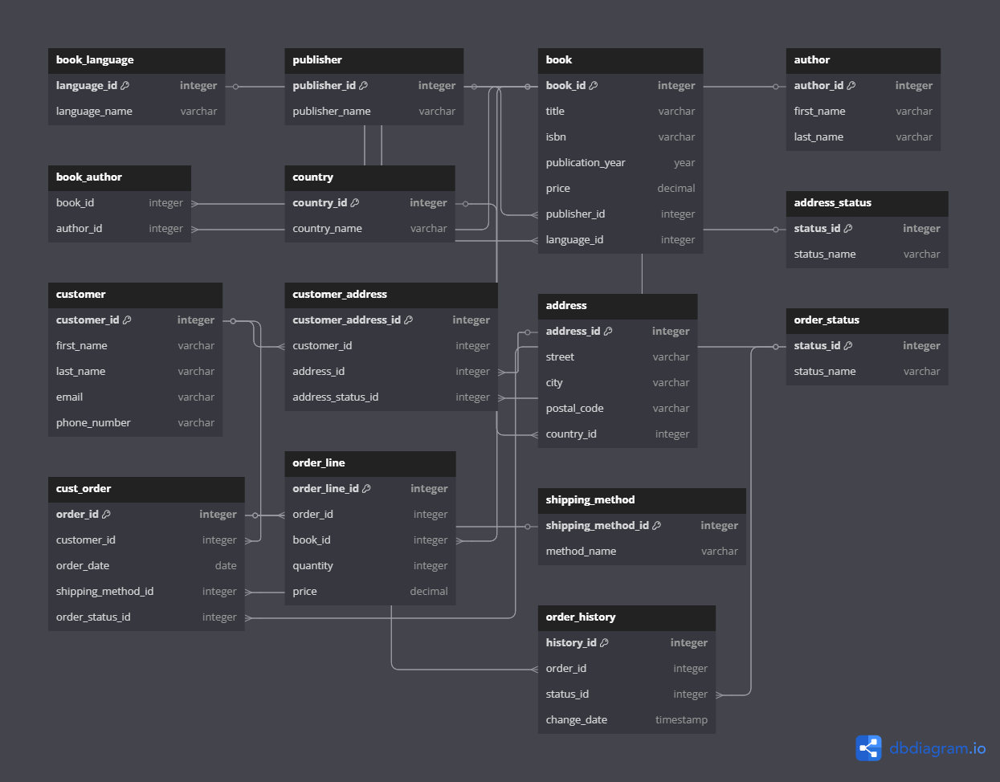
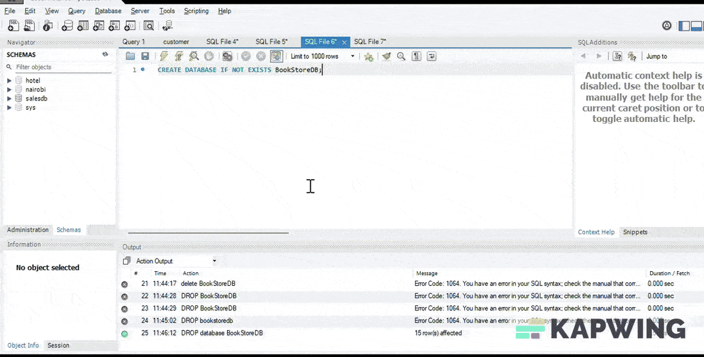

# BookStore
# 📘 BookStore Database Project

## 🧱 ER Diagram Preview





---

## 📦 Project Summary

This is a full-stack SQL-based database system for managing a bookstore's operations. It includes schema creation, user access control, and sample queries for testing.

---

## 📂 Project Files

| File | Description |
|------|-------------|
| `bookstore.sql` | SQL for the whole project |
| `schema.sql` | SQL code to create all database tables |
| `sample_data.sql` | Inserts statements to test the relationships |
| `analytics.sql` | SQL script is designed to analyze data from a book store database |
| `test.sql` | Queries to confirm the functionality of the relationships |
| `users_roles.sql` | SQL to create MySQL users with permissions |
| `README.md` | Documentation |
| `Bookstore.png` | Visual ERD schema |

---

## 🚀 Setup Instructions

```bash
# Clone the repository
git clone https://github.com/your-username/bookstore-db-project.git
cd bookstore-db-project

# Open MySQL and run
SOURCE schema.sql;
SOURCE users_roles.sql;
